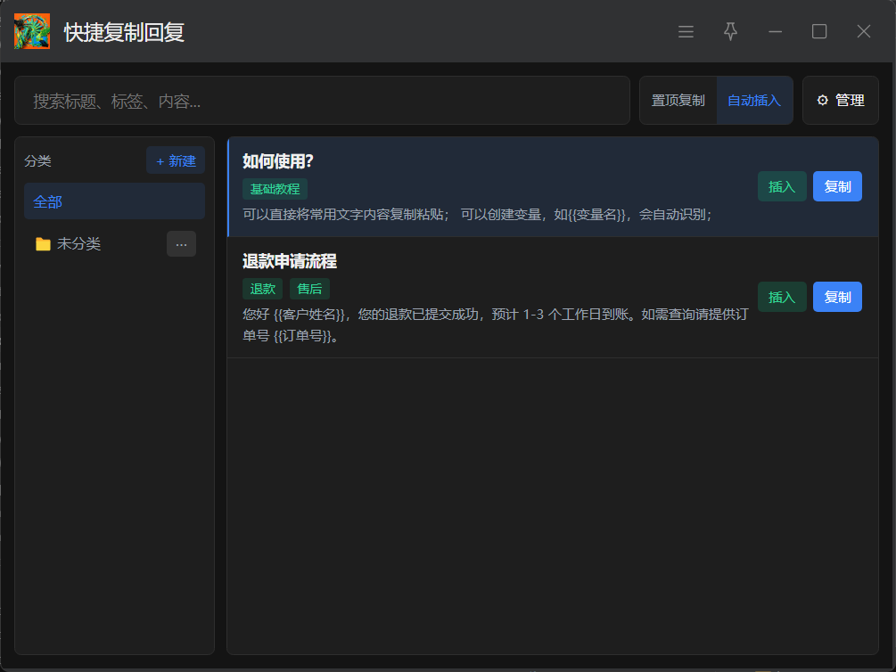
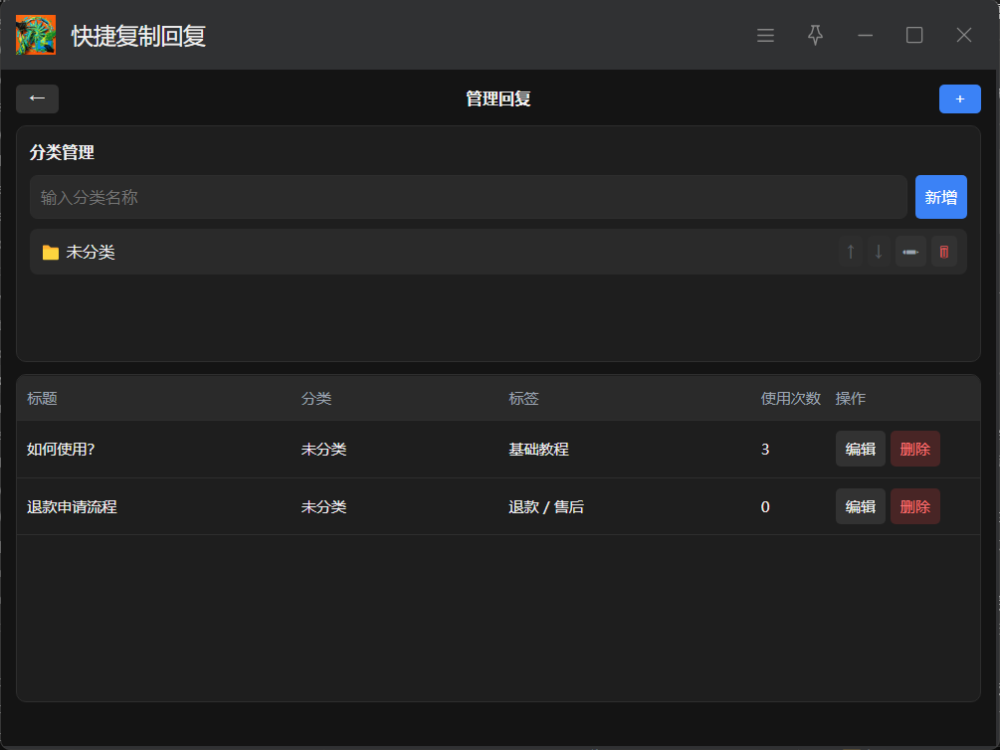

# 快捷复制回复

> 一款面向客服场景的 [uTools](https://u.tools) 快捷回复插件，帮你在最短时间内找到、填写、发出常用回复。



---

## 解决什么问题

客服日常工作中，大量时间消耗在重复打字、查找素材、手动改写变量信息（客户姓名、订单号等）上。本插件将回复模板结构化存储，通过模糊搜索快速命中，再配合变量填写与图片逐张复制，让每一条回复的发出只需几秒。

---

## 核心功能

**使用侧（主面板）**
- 模糊搜索（标题 / 标签 / 内容），无搜索词时按使用频次排序
- 分类侧边栏快速筛选
- 一键**复制**文本到剪贴板，或**自动插入**到当前输入框（含失败重试与降级兜底）
- 变量占位符 `{{变量名}}` 在发送前弹窗填写，自动替换
- 含图片的回复：文本发出后，图片以缩略图展示供逐张复制（兼容微信等不支持图文混贴的场景）

**管理侧（管理页）**



- 回复 CRUD：标题、分类、标签、正文、图片（大图自动压缩）
- 分类 CRUD + 上下排序，删除分类时可将回复迁移至其他分类

---

## 安装与使用

本插件运行在 [uTools](https://u.tools) 平台上。

1. 下载最新 Release 的 `.upx` 文件（或从 uTools 插件市场搜索「快捷复制回复」）
2. 在 uTools 中导入插件
3. 唤起 uTools，输入关键词 `快捷回复` / `客服回复` / `reply` 打开主面板
4. 输入 `管理回复` / `reply-admin` 进入管理页，添加你的回复模板

---

## 本地开发

```bash
npm install
npm run dev    # 启动 Vite 开发服务器，浏览器预览（自动 mock uTools API）
npm run build  # 构建到 dist/，供 uTools 开发者模式加载
```

在浏览器中开发时，`src/utils/mock-preload.js` 会自动模拟 uTools 的 `db` / 窗口控制等 API，数据存储在内存中（刷新即清空）。

要测试真实的复制、自动插入、图片复制等行为，需要在 uTools 开发者模式下加载 `dist/` 目录进行实机验证。

---

## 技术栈

| 用途 | 库 |
|------|----|
| 框架 | Vue 3 + Vite |
| 状态管理 | Pinia |
| 路由 | Vue Router（Hash 模式） |
| UI 组件 | Naive UI |
| 富文本编辑 | Tiptap |
| 模糊搜索 | Fuse.js |
| 宿主平台 | uTools API |

---

## 注意事项

- **自动插入**依赖操作系统焦点与目标应用行为，无法保证 100% 命中，稳定场景推荐使用「复制」模式
- **微信等 IM** 通常不支持图文一次粘贴，使用「先文字后逐张图片」流程
- uTools db 单条记录上限约 1MB，插件已对图片自动压缩并拆分存储，仍建议控制单条回复的图片数量与体积
